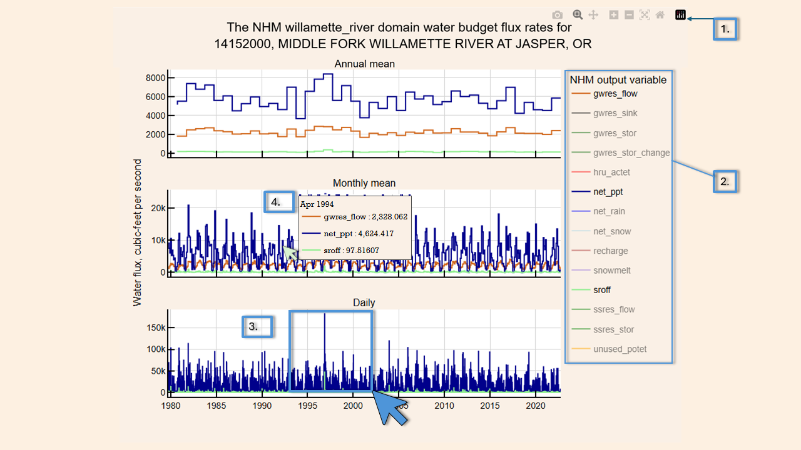
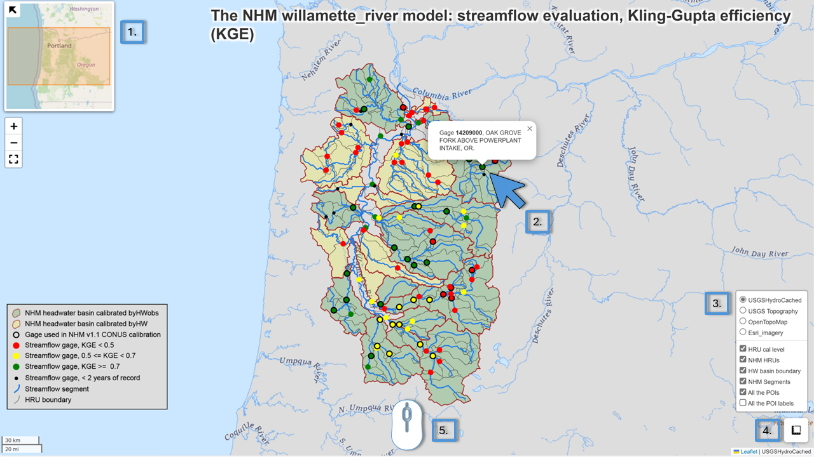

# nhm-assist

nhm-assist is a collection of python workflows presented in Jupyter notebooks for evaluating, running and interpreting [National Hydrologic Model (NHM)](https://www.sciencebase.gov/catalog/item/626c0d67d34e76103cd2ce4a) subdomain models using [`pywatershed`](https://github.com/EC-USGS/pywatershed), a python package for simulating hydrologic processes motivated by the need to modernize important, legacy hydrologic models at the USGS, particularly the Precipitation-Runoff Modeling System (PRMS, Markstrom et al., 2015). nhm-assist allows users to:

- evaluate hydrofabric element connections such as hydrologic response unit connections to streamflow segments, segment routing order, and gage placement accuracy;
- display NHM domain parameter values on interactive maps and plots;
- run the NHM domain using `pywatershed` and create output for chosen variables;
- display NHM domain output values, such as recharge or actual evapotranspiration, on interactive maps and plots; and
- display simulated and observed streamflow for model gages on interactive plots.

Select interactive maps and plots generated by nhm-assist are saved locally in .html format and displayed in a web browser.

## Install conda-forge miniforge on your PC

Instructions for standard installation of conda-forge miniforge is available at this [link](https://github.com/conda-forge/miniforge)
For USGS users, it is recommended to check with your IT department for guidance.

## Clone the nhm-assist repository to a project folder

Navigate to the desired location in the miniforge prompt and then type:

`git clone https://code.usgs.gov/wma/hytest/nhm-assist.git`

**NOTE**: When you clone this repository, you will be on the `main` branch, which includes active development work. If you want to use the officially released version of this code, you should switch over to one of the versioned branches that have been officially released (e.g. `git checkout 1.0.0`).

## Build the environment

Open a miniforge prompt.

If the `nhm` environment already exists, then remove it:

`mamba remove -y --name nhm --all`

Install a fresh env:

`mamba env create -f environment.yaml`

## Retrieve a provided NHM subdomain model

If you have been provided a NHM subdomain model, it can be downloaded from the USGS [HyTEST](https://hytest-org.github.io/hytest/doc/About.html) OSN storage pod by following these steps.

In the miniforge prompt, navigate to the nhm-assist folder, and run

`python pull_domain.py --name=willamette_river`

This will create a domain_data folder and add the example subdomain for the Willamette River watershed.

## Activate the environment:

In the miniforge prompt, navigate to the nhm-assist folder, and run

`mamba activate nhm`

## Launch Jupyter

In the miniforge prompt, navigate to the nhm-assist folder, and run

`jupyter lab`

Ready to go! :+1:

## nhm-assist plots and maps

nhm-assist interactive plots are created using [plotly](https://plotly.com/python-api-reference/). These figures facilitate evaluation of NHM subdomain model parameters and output. Interactive plots will open in new browser tabs and are exported to `./domain_data/subdomain/notebook_output_files/html_plots`.

Additionally, nhm-assist interactive maps are created using [folium v0.18.0](https://python-visualization.github.io/folium/v0.18.0/index.html). These maps visualize geospatial elements of the NHM subdomain. Additionally, select maps include embedded plotly figures. Folium maps will open in new browser tabs and are exported as html files to `./domain_data/subdomain/notebook_output_files/html_maps`. Users may interact with these maps and embed them in webpages, presentations, or other places external to the jupyter notebook repository.

### Plot interaction

1. Hovering your mouse in the top-right corner of the plot will display a **modebar**. The buttons in this bar allow the user to export the plot as a static figure png, zoom, pan, zoom in, zoom out, autoscale axes, or reset axes.
1. Legends are also interactive. Left-clicking a legend item will display or hide its associated data on the plots.
1. With the zoom tool selected from the modebar, click and drag the mouse to draw a box and zoom to a specific region in the plot to see higher detail, e.g, clicking and dragging in the daily data plot a user can see
1. Hover over data in the plots to view a pop-up containing detailed information for that point

### Map interaction

1. Maps contain a thumbnail regional map in the upper left-hand corner that can be collapsed by left-clicking on the upper left corner of the thumbnail map. Below the thumbnail map are tools to zoom in/zoom out or expand the map to full screen.
1. Left-click map on hydrofabric elements (HRU's, gages, segments) to display a pop-up with more detail regarding the element. The displayed information will vary with the type of hydrofabric element that the user clicks and the active notebook.
1. Click the layer control button in the lower right-hand corner to bring up the layer control. Here, users can select a basemap, activate/hide specific map layer, and turn labels on or off. **Note** As a user toggles layers on/off, they are redrawn in order of activation, e.g., the first layer a user activates will be rendered on the bottom. Layer order may affect pop-up display. When viewed in a browser tab, refresh the tab to reset layer order.
1. Left-click the measure tool and trace lines or polygons to estimate distances or areas.
1. Left-click and drag the map to pan. Use the scroll wheel to zoom in or out.

## Citation

Haj, A.E., Barker, M.I., Norton, P.A., McCreight, J.L., Ludden, L.L., and Snyder, A.M., 2025, nhm-assist: a collection of python workflows presented in Jupyter notebooks for evaluating, running and interpreting National Hydrologic Model (NHM) subdomain models, version 1.0.0: U.S. Geological Survey software release, https://doi.org/10.5066/P1NMW6US.
